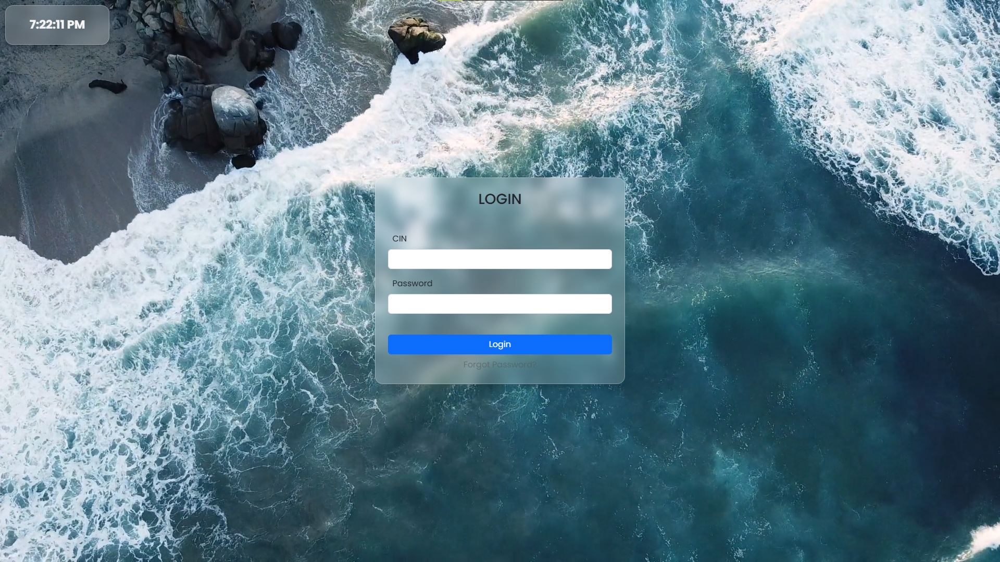
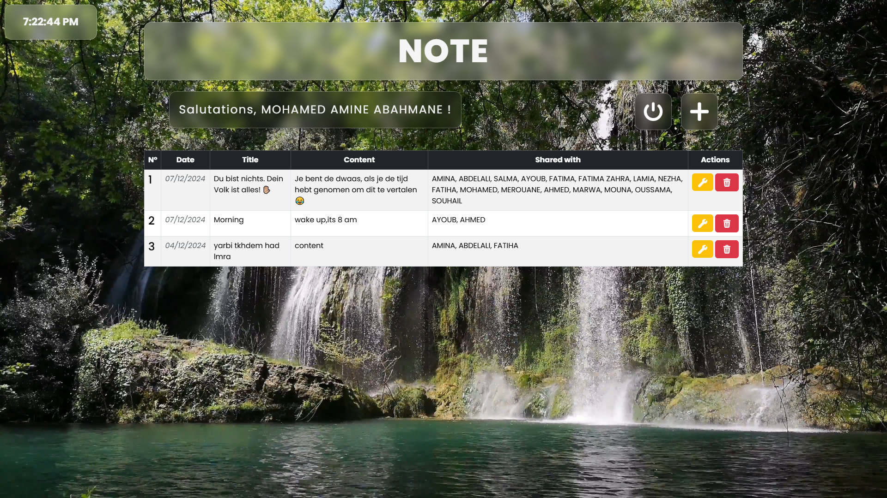
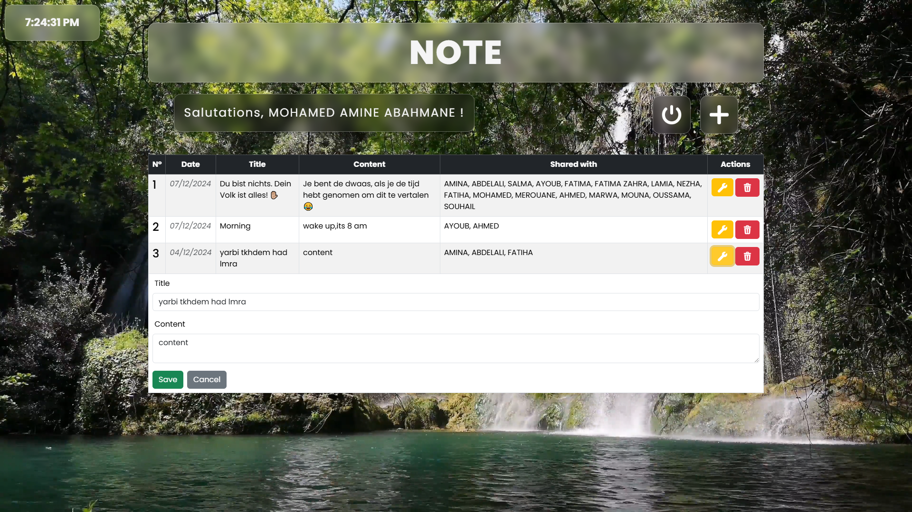
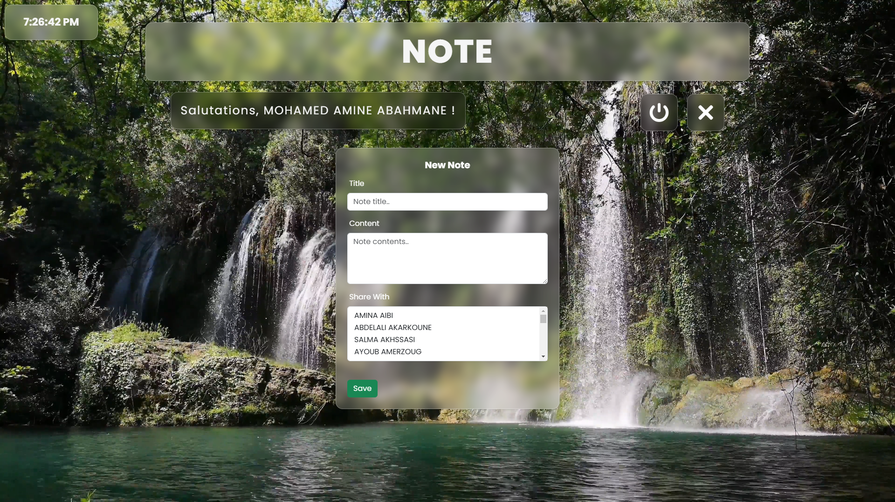
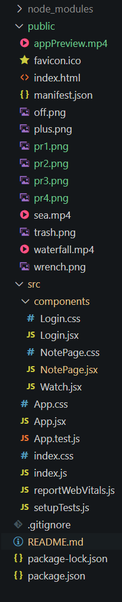

# Notes Application

## Overview

This is a simple To-Do List application built using React. Users can log in, create, update, share, and delete notes. The app also allows note-sharing with other registered users. Authentication is managed via a token stored in localStorage.

## Features
- User authentication
- Create new notes
- Edit existing notes
- Delete notes
- Share notes with other users
- Display all notes in a tabular format
- Background video for aesthetics
- User logout functionality

## Preview

<video controls loop muted>
  <source src="appPreview.mp4" type="video/mp4">
  Your browser does not support the video tag.
</video>

## Codebase

## Setup and Installation
Clone the repository: `` git clone https://github.com/your-username/notes-app.git cd notes-app ``

Install dependencies: `` npm install ``

Start the development server: `` npm start ``

## How to Contribute
- Fork the repository.
- Make your changes.
- Submit a pull request.

## License
This project is licensed under the MIT License.

#### _.MAA_